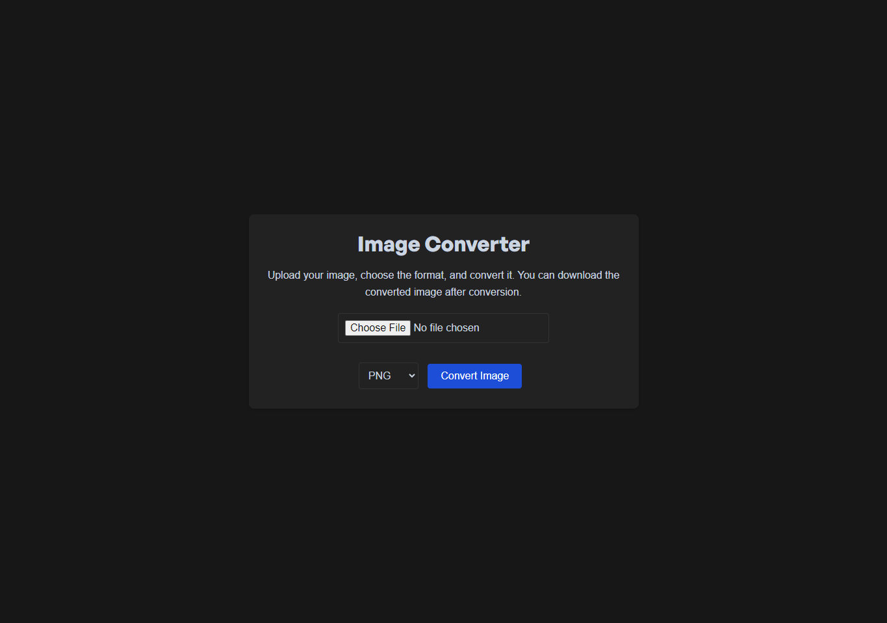

# Image File Converter

## Overview

This project is a web-based image file converter application that allows users to upload an image, select a desired output format, and convert the image to that format. The application provides an intuitive and user-friendly interface and supports multiple image formats including PNG, JPEG, WEBP, GIF, BMP, TIFF, ICO, SVG, TGA, and RAW.
[Website Link](https://image-converter-ebon.vercel.app/)

### Features

- **Image Upload**: Users can select and upload an image file.
- **Format Selection**: Users can choose the desired output format from a dropdown menu.
- **Conversion and Download**: Users can convert the uploaded image to the selected format and download it.
- **Success Notification**: After conversion, users receive a success message with a download link for the converted image.
- **Modern UI**: The interface is styled with a modern, dark theme and features a smooth color-changing favicon.

## Demo

 <!-- Replace with a demo image or GIF -->

## Table of Contents

- [Installation](#installation)

## Installation

To get started with the Image File Converter project, follow these steps:

1. **Clone the Repository**

   ```bash
   git clone https://github.com/MarlonM-Dev/Image-Converter
   cd image-file-converter
   ```

2. **Open the Project**

   Open the index.html file in your web browser. The application does not require any server-side setup or additional dependencies.
